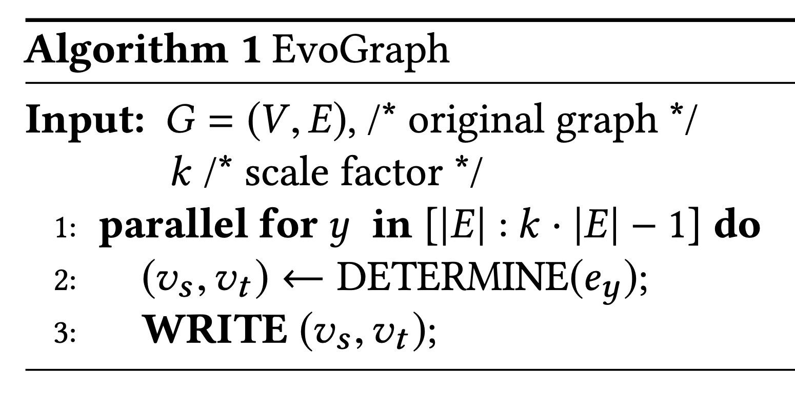

# EvoGraph: An Effective and Efficient Graph Upscaling Method for Preserving Graph Properties.

## Background
Implementation of KDD '18 accepted paper, EvoGraph. This graph upscaling method paper can be found in the `Citations` section at the bottom.

Implementations of both [normal](/evograph/src/evograph.py) and [parallel computing](/evograph/src/evographParallel.py) are present.


## Algorithm
 

Basic Edge Attachment: non-recursive edge attachment. The paper does not use BEA, but it is present to show what the edge-attachment look like. Basic edge attachment works for a upscale by a factor of 2, as there is no recursion necessary until a scale factor of 3. 


Memory-efficient Edge Attachment: recursive edge attachment. Parent edges must be in level sf=1. When a parent edge is found, but that parent edge is not in sf=1, the recursive call works backwards to call itself, until a parent edge in sf=1 is found. This MEA is the actual DETERMINE(ey) function


The calculations of the parent edge is the function h1(y), shown below:
```
# x ~ U(0, (k-1)*|E|-1)
def h1(key):
    return H(key) mod( (k-1) * |E| )
```

The calculation of the direction of the newly-attached edge is the function h2(y), shown below:
```
# direction ~ U(0, 1)
def h2(key):
    return H(key) % 2
```

The uniform random variable hashing functions above reference H(key), which is shown below:
```
def H(key): 
    return ((key + 13) x 7)
```

Once the parent edge and direction have been calculated using h1 and h2, we must determine the new edge the be attached. This is done, based on the calculated direction, by referencing the proper node in the current scale factor level that is aligned with the node in the initial graph. For instance, with initial graph, and level 2 graph having nodes:

``` initial graph   -> v0 v1 v2 v3 ```

``` current k graph -> v4 v5 v6 v7 ```

The reference node of v0 is v4, v1 is v5, and so on. This final calculation of the refernce nodes is the final calculation necessary in determining the edge to be attached. 


## Parallel Computation 
It is possible to multi-process the main for-loop of the algorithm. 
Why is parallel computing allowed?
* EvoGraph does not store the currently-upscaling graph in main memory
* The graph is both read and written from the same file, on disk
* Each newly added edge is read by a different thread, and placed back into the file when the parent edge calculation is finished
* Experimental results led to conclusion that ~100-110 threads is optimal
* Since the initial file can be referenced from anywhere, read at any time in the upscale, and written back into at any time, distributed, parallel computing is allowed.
* The use of locks on the file is therefore unnecessary, as any amount of instances can access the file at any time. 

Why are the writes out of order? 
* Some of the parent-edge calculations require recursion
* Earlier reads might be written back into the file later
* Out of order does not matter, as all threads read/write their own unique thread

Normal for-loop
```
for EdgeInstance.currentNumEdges in range(EdgeInstance.initialNumEdges, maxNumEdges):
    vsvt = DETERMINE(EdgeInstance.currentNumEdges)
    WRITE(vsvt, EdgeInstance.currentNumEdges, fileToUpscale)
```

Parallelized for-loop
```
def parallel(fileToUpscale, kValToUpscaleTo, processes):
    p = Pool(processes=processes)
    iterRange = list(range(EdgeInstance.initialNumEdges, maxNumEdges))
    p.map(EvoGraph, iterRange)
    p.close()

def EvoGraph(currentNumEdges):
    vsvt = DETERMINE(currentNumEdges)
    WRITE(vsvt, currentNumEdges, fileToUpscale)
```
## Example

Initial graph: 


Scaled by a factor of 2:


Scaled by a factor of 3:


Initial graph file representation: 


---
## Experimental Results

We will now show our experimental results with normal computation and parallel computation on the small scale dataset shown above. Tabs on the Expected graphs are to show the newly added edges for that level.

## Graph upscaled by scale factor of 2:

Expected             |  Single Thread       | Multithread (3 threads)
:-------------------------:|:-------------------------:|:-------------------------:
  |   |  

## Graph upscaled by scale factor of 3:
Expected             |  Single Thread       | Multithread (9 threads)
:-------------------------:|:-------------------------:|:-------------------------:
  |   |  

## Graph upscaled by scale factor of 4:
Expected             |  Single Thread       | Multithread (12 threads)
:-------------------------:|:-------------------------:|:-------------------------:
  |   |  


## Citation

Himchan Park and Min-Soo Kim. 2018. EvoGraph: An Effective and Efficient Graph Upscaling Method for Preserving Graph Properties. In Proceedings of the 24th ACM SIGKDD International Conference on Knowledge Discovery & Data Mining (KDD '18). ACM, New York, NY, USA, 2051-2059. DOI: https://doi.org/10.1145/3219819.3220123

Original Implementation GitHub: https://github.com/chan150/EvoGraph
